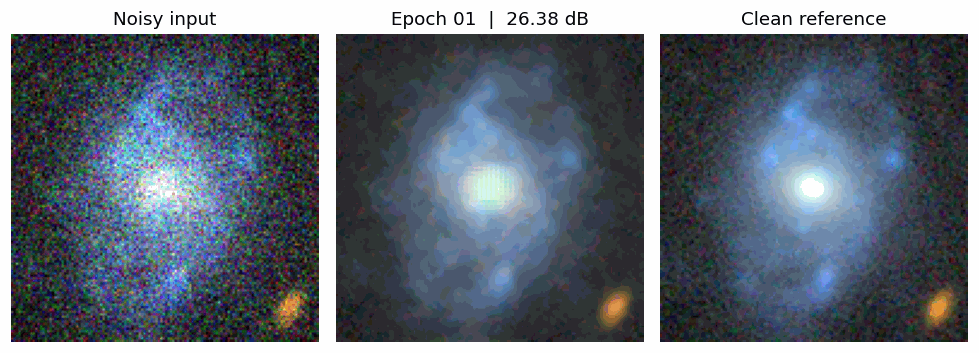
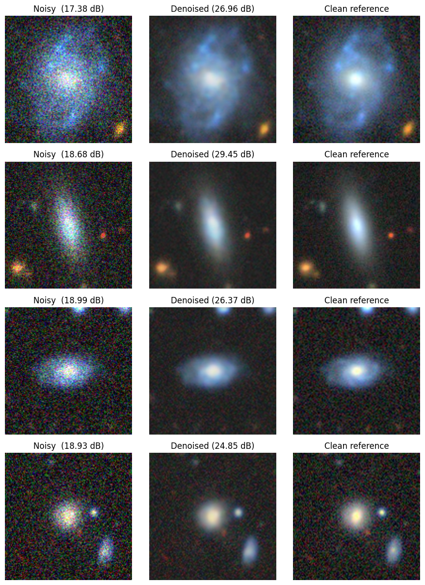
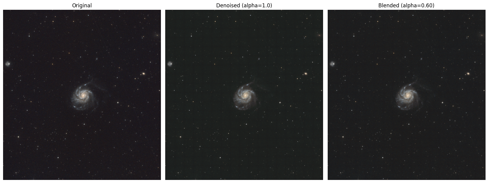

# Noise2Noise-astro

**Denoising astrophotography images without clean ground truth.**

[](https://colab.research.google.com/github/astroedo/Noise2noise-astro/blob/main/Noise2Noise_Astro_2.ipynb)
[](LICENSE)

A U-Net trained with the **Noise2Noise** framework (Lehtinen et al., ICML 2018) on Galaxy10 DECaLS — the network never sees a clean image, only pairs of independent noisy views.

---

## Results

Validation on synthetic noise (Galaxy10):

| Metric | Noisy | Denoised |
|---|---|---|
| PSNR (dB) | 18.2 | **26.9** |
| SSIM | 0.27 | **0.78** |





### Real-world: M101 (Pinwheel Galaxy)

Applied to a 4168×3840 amateur astrophoto via tiled inference (256 px tiles, 32 px overlap).




---

## How it works

If noise is zero-mean and independent across two observations, training on `(noisy_A, noisy_B)` pairs converges to the same denoiser as training against the true clean image. This fits astronomical sensors well: Poisson shot noise + Gaussian read noise are both zero-mean, and successive exposures are independent.

---

## Running

**Colab (recommended):** click the badge, set Runtime → GPU (T4), Run all. ~15 min end-to-end.

**Local:**

```bash
pip install -r requirements.txt
jupyter notebook Noise2Noise_Astro_2.ipynb
```

To denoise your own image, edit section 10 of the notebook:

```python
image_path = 'path/to/your_astrophoto.jpg'
alpha = 0.6   # 1.0 = full denoise, 0.0 = original
```

---

## Limitations

- N2N requires **zero-mean, independent** noise. Structured artifacts (JPEG blocking, hot pixels, amp glow) will be learned rather than removed.
- Trained on synthetic noise over Galaxy10 patches — can over-smooth dense star fields. The `alpha` blend mitigates this; fine-tuning on real noisy pairs is the proper fix.

---

## References

1. Lehtinen et al. **Noise2Noise: Learning Image Restoration without Clean Data.** ICML 2018. [arXiv:1803.04189](https://arxiv.org/abs/1803.04189)
2. Ronneberger et al. **U-Net.** MICCAI 2015. [arXiv:1505.04597](https://arxiv.org/abs/1505.04597)
3. Leung & Bovy. **Galaxy10 DECaLS.** [astroNN docs](https://astronn.readthedocs.io/en/latest/galaxy10.html)

---

MIT License. See [LICENSE](LICENSE).
